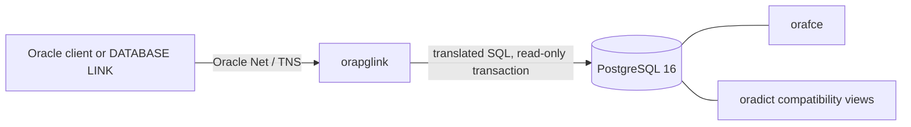

<div align="center">
  <h1>orapglink</h1>
  <p><strong>Use Oracle clients to query PostgreSQL through Oracle Net (TNS/TTC).</strong></p>
  <p>A read-only compatibility proxy: ordinary Oracle drivers and database links on one side, PostgreSQL 16 on the other.</p>

  <a href="https://github.com/krokozyab/postgres-oracle-tns-proxy/releases/tag/v0.1.0-preview.2"></a>
  <a href="https://github.com/krokozyab/postgres-oracle-tns-proxy/releases/tag/v0.1.0-preview.2"></a>
  <a href="https://github.com/krokozyab/postgres-oracle-tns-proxy/releases/tag/v0.1.0-preview.2"></a>

  <br /><br />

  
  
  
</div>

<br />

`orapglink` is a read-only compatibility proxy. Oracle-facing tools connect to
it as if they were connecting to an Oracle service; the proxy translates the
supported SQL subset and executes it against PostgreSQL.

> This repository is the distribution and documentation repository. It does
> **not** contain the product source code. Prebuilt binaries and checksums are
> published on the [Releases](https://github.com/krokozyab/postgres-oracle-tns-proxy/releases)
> page.

## Download

The current release is
[v0.1.0-preview.2](https://github.com/krokozyab/postgres-oracle-tns-proxy/releases/tag/v0.1.0-preview.2):

| Platform | Archive |
|---|---|
| Linux x86-64 | `orapglink_0.1.0-preview.2_linux_amd64.tar.gz` |
| Linux ARM64 | `orapglink_0.1.0-preview.2_linux_arm64.tar.gz` |
| macOS Apple silicon | `orapglink_0.1.0-preview.2_darwin_arm64.tar.gz` |
| Windows x86-64 | `orapglink_0.1.0-preview.2_windows_amd64.tar.gz` |

Download the archive for your platform and `SHA256SUMS` from the release page.
Verify it before unpacking:

```sh
# macOS
shasum -a 256 -c SHA256SUMS

# Linux
sha256sum -c SHA256SUMS
```

Each archive contains the binary, ready-to-copy configuration, PostgreSQL SQL
setup files, quick starts in English and Russian, limitations, and dependency
license notices. The binaries are obfuscated with `garble -tiny -literals` and
stripped with the Go linker flags `-s -w`; they are not encrypted. The product
source remains private.

## What it is for

- Query PostgreSQL from DBeaver, SQL Developer/SQLcl, python-oracledb,
  ODP.NET, JDBC and SQL\*Plus-compatible flows.
- Expose PostgreSQL data through an Oracle `DATABASE LINK`.
- Give reporting and integration tools an Oracle-shaped, read-only view of a
  PostgreSQL database.

It is not a general Oracle Database replacement. The supported SQL and wire
shapes are deliberately bounded, and unsupported operations fail rather than
guessing.



## Current status

The project is an experimental preview. The first binary release is available
as `v0.1.0-preview.2` for Linux amd64/arm64, macOS arm64 and Windows amd64.
Release archives include checksums, documentation, configuration examples, SQL
setup files, license texts and third-party notices.

The product source remains private. Issues, operational documentation,
configuration templates and release artifacts live here so users do not need
source access to install or operate the proxy.

## Quick start

Download and unpack the archive for your platform, then start with
[QUICKSTART.md](QUICKSTART.md) or its
[Russian translation](QUICKSTART_RU.md). The setup has four parts:

1. Install PostgreSQL 16 and the `orafce` extension.
2. Create the read-only runtime role with [sql/provision_roles.sql](sql/provision_roles.sql).
3. Install the Oracle dictionary compatibility views with
   [sql/oracle_compat_views.sql](sql/oracle_compat_views.sql).
4. Copy [config.env.example](config.env.example), set the shared Oracle-side
   password and PostgreSQL DSN, then start the downloaded binary.

A zero-configuration PostgreSQL 16 demo is under
[deploy/docker](deploy/docker/README.md). It installs `orafce`, roles,
dictionary views and sample data automatically. Add a downloaded Linux
`orapglink` binary and the same Compose stack runs a real python-oracledb smoke
test through Oracle Net. No `.env` file is required, and it never contains or
builds the private source.

For manual installation, PostgreSQL provisioning, service deployment, and
upgrades, see [Installation and deployment](doc/setup.md).

## Security model

Read [KNOWN_LIMITATIONS.md](KNOWN_LIMITATIONS.md) before deployment. The most
important constraints are:

- The proxy is read-only. Writes and DDL are rejected, and backend work runs
  in PostgreSQL read-only transactions under a role without write grants.
- Authentication is single-tenant: one shared Oracle-side password, while the
  supplied username is not a PostgreSQL identity.
- Oracle native network encryption and TCPS are not implemented. Keep the TNS
  listener on loopback or a trusted network/VPN, or place a TLS tunnel in
  front. Never expose it directly to the Internet.
- Metrics and playground listeners have no authentication and are disabled by
  default.

For vulnerabilities, follow [SECURITY.md](SECURITY.md). Never attach
credentials, production data, low-level diagnostic artifacts or unredacted
logs to a public issue.

## Compatibility contract

- [TRANSLATOR_SUPPORT.md](TRANSLATOR_SUPPORT.md) describes the supported,
  approximated, rejected and passthrough SQL features.
- [KNOWN_LIMITATIONS.md](KNOWN_LIMITATIONS.md) describes operational and
  client limitations.
- The release verification matrix states the exact client families exercised
  by the published build and the number of passing cases.

## Operations

The optional loopback operations listener provides Prometheus metrics and
health probes:

```sh
ORAPGLINK_METRICS_LISTEN=127.0.0.1:9109 ./orapglink

curl -fsS http://127.0.0.1:9109/healthz
curl -fsS http://127.0.0.1:9109/readyz
curl -fsS http://127.0.0.1:9109/metrics
```

The endpoint has no authentication or TLS and is off by default. Keep it on
loopback or protect it with a reverse proxy. Metric names, PromQL examples, and
alerting guidance are in [Observability](doc/observability.md).

## Documentation

| Guide | Description |
|---|---|
| [Quick Start](QUICKSTART.md) · [Russian](QUICKSTART_RU.md) | Download to the first Oracle query, with complete PostgreSQL provisioning |
| [Installation and deployment](doc/setup.md) | Docker demo, manual installation, systemd, network placement, and upgrades |
| [PostgreSQL prerequisites](doc/postgresql.md) | PostgreSQL 16, orafce, roles, grants, dictionary views, and schema mapping |
| [Connecting clients](doc/clients.md) | python-oracledb, DBeaver, SQLcl/SQL*Plus, JDBC, ODP.NET, go-ora, and DATABASE LINK |
| [Configuration](doc/configuration.md) | Flags, environment variables, defaults, resource settings, and inspection commands |
| [Limits and guardrails](doc/limits.md) | Memory envelope, query/cursor/connection limits, PostgreSQL backstops, and read-only layers |
| [Observability](doc/observability.md) | Prometheus metrics, `/healthz`, `/readyz`, PromQL, alerts, and logging |
| [Testing and verification](doc/testing.md) | The 722-case release matrix, package smoke test, verification scope, and non-claims |
| [Troubleshooting](doc/troubleshooting.md) | Startup, connection, catalog, query, GUI, and diagnostic guidance |
| [SQL support contract](TRANSLATOR_SUPPORT.md) | Supported, approximated, rejected, and passthrough Oracle SQL features |
| [Known limitations](KNOWN_LIMITATIONS.md) | User-visible constraints and safe workarounds |
| [Security](SECURITY.md) | Deployment assumptions and private vulnerability reporting |

## Repository contents

| Path | Purpose |
|---|---|
| `QUICKSTART.md`, `QUICKSTART_RU.md` | Installation and first query |
| `config.env.example` | Environment configuration template |
| `sql/` | PostgreSQL role and Oracle dictionary provisioning |
| `deploy/docker/` | Self-contained PostgreSQL demo and binary-only proxy deployment |
| `doc/` | Operations, deployment, client, configuration and troubleshooting guides |
| `KNOWN_LIMITATIONS.md` | User-visible constraints and workarounds |
| `TRANSLATOR_SUPPORT.md` | Oracle-to-PostgreSQL SQL support contract |
| `THIRD_PARTY_NOTICES.md`, `licenses/` | Binary dependency notices |

## Independence and trademarks

`orapglink` is an independent interoperability project. It is not affiliated
with, endorsed by, sponsored by or supported by Oracle Corporation or the
PostgreSQL Global Development Group. It contains and distributes no Oracle
software. Oracle and other Oracle product names are trademarks or registered
trademarks of Oracle Corporation and/or its affiliates and are used here only
to describe compatibility.

## License

The distribution materials are licensed under the
[Apache License 2.0](LICENSE). Third-party components included in release
binaries retain their own licenses; see
[THIRD_PARTY_NOTICES.md](THIRD_PARTY_NOTICES.md).
